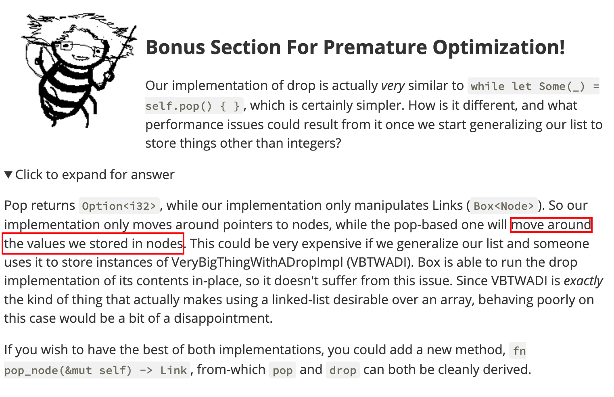

## Learning Rust with Entirely Too Many Linked Lists-Ch2

### 2. A Bad Stack

#### 2.1 Layout

##### Zero optimization

> ##### Niche
>
> The *niche* of a type determines invalid bit-patterns that will be used by layout optimizations.
>
> For example, `&mut T` has at least one niche, the "all zeros" bit-pattern. This niche is used by layout optimizations like ["`enum` discriminant elision"](https://github.com/rust-lang/unsafe-code-guidelines/blob/636d140ce9c74ffc4d1fc082bef0771f238f64c9/reference/src/layout/enums.html#discriminant-elision-on-option-like-enums) to **guarantee that `Option<&mut T>` has the same size as `&mut T`.**
>
> While all niches are invalid bit-patterns, not all invalid bit-patterns are niches. For example, the "all bits uninitialized" is an invalid bit-pattern for `&mut T`, but this bit-pattern cannot be used by layout optimizations, and is not a niche.

##### Pub or not pub


#### 2.2 New

No new things


#### 2.3 Ownership 101

There are 3 primary forms that self can take: `self`, `&mut self`, and `&self`. These 3 forms represent the three primary forms of ownership in Rust:

- `self` - Value
- `&mut self` - mutable reference
- `&self` - shared reference

A **value** represents *true* ownership.（这句话的定义在接下来的教程中十分重要）

> A shared reference represents temporary *shared access* to a value that you don't own. Because you have shared access, you're **generally not allowed to** mutate anything. Think of `&` as putting the value out on display in a museum. `&` is great for methods that only want to **observe** `self`.
>
> Later we'll see that the rule about mutation can be **bypassed** in certain cases. This is why **shared references aren't called *immutable* references**. Really, mutable references could be called *unique* references, but we've found that relating ownership to mutability gives the right intuition 99% of the time.


#### 2.4 Push

`std::mem::replace` will help us bypass the ownership borrowing problem with `replacing` the value instead of giving its ownership away.

这与CS110L课程中`option`的`take`方法类似，其能起效的原因在于始终没有进行对所有权的转交，而是采用了原语进行了值的替换。


#### 2.5 Pop

谈论了match 语句中的所有权问题，例如下面的表达式将会进行所有权转移，而我们在这个函数中并没有拿到self的所有权，所以complier yells at us

```rust
pub fn pop(&mut self) -> Option<i32> {
    match self.head { 
        Link::Empty => {
            // TODO
        }
        Link::More(node) => { 
            // TODO
        }
    };
    unimplemented!()
}
```

>  By default, a pattern match will try to **move its contents into the new branch**, but we can't do this because we don't own **self by-value** here.（因为传来的是&mut，即mutable ref，而不是value）

再来看看下面的所有权问题

```rust
pub fn pop(&mut self) -> Option<i32> {
    let result;
    match &self.head {
        Link::Empty => {
            result = None;
        }
        Link::More(node) => {
            result = Some(node.elem);
            self.head = node.next;
        }
    };
    result
}
```

这里仍然会报错，因为我们试图获得node.next的所有权，但是这里node对应的是match的&self.head，它是一个shared reference，没有办法给到所有权。

作者在这里再一次地使用了mem::replace的黑魔法，代码如下：

```rust
pub fn pop(&mut self) -> Option<i32> {
    match mem::replace(&mut self.head, Link::Empty) {
        Link::Empty => None,
        Link::More(node) => {
            self.head = node.next;
            Some(node.elem)
        }
    }
}
```

它确实符合从头部摘出node的定义，逻辑功能全部正确。


#### 2.6 Testing

> All we have to do is write a function, and annotate it with `#[test]`.


#### 2.7 Drop

作者向我们展示了如果采用默认的Drop方法进行操作的话是有问题的，可能会导致栈溢出，为此他也说明了linklist释放的过程并非尾递归形式的。

最后，给出了正确的（不仅仅完成了内存回收，而且是高效的）写法

```rust
impl Drop for List {
    fn drop(&mut self) {
        let mut cur_link = mem::replace(&mut self.head, Link::Empty);
        // `while let` == "do this thing until this pattern doesn't match"
        while let Link::More(mut boxed_node) = cur_link {
            cur_link = mem::replace(&mut boxed_node.next, Link::Empty);
            // boxed_node goes out of scope and gets dropped here;
            // but its Node's `next` field has been set to Link::Empty
            // so no unbounded recursion occurs.
        }
    }
}
```

注意到整个过程只有指针的fiddling，没有任何其他的内存拷贝，所以是很高效的。

最后，作者给出了一个问题：如果采用pop的方法来做drop会有什么影响呢？



