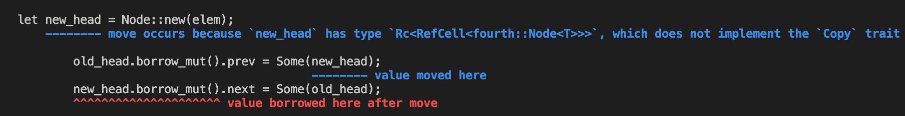

## Learning Rust with Entirely Too Many Linked Lists-Ch5

### 5. A Bad but Safe Doubly-Linked Deque

#### 5.1 Layout

```rust
use std::rc::Rc;
use std::cell::RefCell;

pub struct List<T> {
    head: Link<T>,
    tail: Link<T>,
}

type Link<T> = Option<Rc<RefCell<Node<T>>>>;

struct Node<T> {
    elem: T,
    next: Link<T>,
    prev: Link<T>,
}
```

因为是Deque，所以要维护两端。


#### 5.2 Building up

首先是平平无奇的`new`：

```rust
impl<T> Node<T> {
    fn new(elem: T) -> Rc<RefCell<Self>> {
        Rc::new(RefCell::new(Node {
            elem: elem,
            prev: None,
            next: None,
        }))
    }
}

impl<T> List<T> {
    pub fn new() -> Self {
        List { head: None, tail: None }
    }
}
```

大多数时候我们只需要维护`head`**或者**`tail`节点，但是对于空列表的情况（from or to a empty list），我们会不可避免的维护这两个指针。

对于双向链表这个数据结构来说，需要维持的数据结构的不变量（invariant，可以参考数据结构的网课）是：

每个节点都有两个指针指向他。

对于中间的节点来说，这两个指针来自前驱与后继，而对于edge上的节点来说有一个来自于`list`本身。

下面给了一个`push_front`的例子：

```rust
pub fn push_front(&mut self, elem: T) {
    // new node needs +2 links, everything else should be +0
    let new_head = Node::new(elem);
    match self.head.take() {
        Some(old_head) => {
            // non-empty list, need to connect the old_head
            old_head.prev = Some(new_head.clone()); // +1 new_head
            new_head.next = Some(old_head);         // +1 old_head
            self.head = Some(new_head);             // +1 new_head, -1 old_head
            // total: +2 new_head, +0 old_head -- OK!
        }
        None => {
            // empty list, need to set the tail
            self.tail = Some(new_head.clone());     // +1 new_head
            self.head = Some(new_head);             // +1 new_head
            // total: +2 new_head -- OK!
          	// 也需要注意到头节点是没有指针指出去的
          	// 只有list的head/tail指针指向它
        }
    }
}
```

虽然作者没有说，但是请注意到这句话:

```rust
old_head.prev = Some(new_head.clone());
```

为什么要`clone`呢？答案是显然的，因为ownership问题。不加`clone`编译可以得到如下报错：



让我们看看`Rc`的`clone`都做了啥：

```bash
fn clone(&self) -> Rc<T>
    Makes a clone of the Rc pointer.
    This creates another pointer to the same allocation, increasing the strong reference count.
```

原来是这样增加引用计数的（废话

回到正题，这样写并不能让编译器信服，它会向我们抱怨如下：

```bash
cargo build

error[E0609]: no field `prev` on type `std::rc::Rc<std::cell::RefCell<fourth::Node<T>>>`
  --> src/fourth.rs:39:26
   |
39 |                 old_head.prev = Some(new_head.clone()); // +1 new_head
   |                          ^^^^ unknown field

error[E0609]: no field `next` on type `std::rc::Rc<std::cell::RefCell<fourth::Node<T>>>`
  --> src/fourth.rs:40:26
   |
40 |                 new_head.next = Some(old_head);         // +1 old_head
   |                          ^^^^ unknown field
```

看起来毫无理由。`.`失效了？（看起来没办法一直deref到Node）

>  It worked before when we just had an `Rc<Node>`. Seems like the `RefCell` is getting in the way.

看看远处的文档吧家人们

下面是rust官方文档大意（有关refcell

> 使用Refcell 用以获得internal mutability，Rc并不具备这项功能。
>
> 因为Rc包含的value可能是multiply-aliased的（这里其实就是说多个指针指向了同一个数据）
>
> 另外，Refcell是针对单线程情况下的，多线程请考虑Mutex。

官方文档给出了一个代码片示例教我们怎么获得refcell的mut ref：

```rust
use std::collections::HashMap;
use std::cell::RefCell;
use std::rc::Rc;

fn main() {
    let shared_map: Rc<RefCell<_>> = Rc::new(RefCell::new(HashMap::new()));
    shared_map.borrow_mut().insert("africa", 92388);
    shared_map.borrow_mut().insert("kyoto", 11837);
    shared_map.borrow_mut().insert("piccadilly", 11826);
    shared_map.borrow_mut().insert("marbles", 38);
}
```

看起来我们需要**显式地**加上`borrow_mut`来获得mut ref...

作者这里没有解释就直接上了一个版本：

```rust
pub fn push_front(&mut self, elem: T) {
    let new_head = Node::new(elem);
    match self.head.take() {
        Some(old_head) => {
            old_head.borrow_mut().prev = Some(new_head.clone());
            new_head.borrow_mut().next = Some(old_head);
            self.head = Some(new_head);
        }
        None => {
            self.tail = Some(new_head.clone());
            self.head = Some(new_head);
        }
    }
}
```

编译器没发电，成功了。

wait

我觉得有必要探索一下为什么这里是可行的（为什么`.`失效了呢）

`.`要一直`deref`到`Node`才能获取到`prev`和`next`，然而`Refcell`是没有`Deref trait`的

这个问题是解决了没错，但为什么`borrow_mut`可行呢？它返回了什么？

```rust
pub fn borrow_mut(&self) -> RefMut<'_, T>
// Mutably borrows the wrapped value.
// ATTENTION: Panics if the value is currently borrowed

// PANIC AS BELOW:
let c = RefCell::new(5);
let m = c.borrow();

let b = c.borrow_mut(); // this causes a panic

// RefMut
pub struct RefMut<'b, T>
where
    T: 'b + ?Sized,
{ /* private fields */ }
// A wrapper type for a mutably borrowed value from a RefCell<T>
```

原来只是一个wrapper，装的是一个mut ref

而`borrow`方法也差不多：

```rust
pub fn borrow(&self) -> Ref<'_, T>
// Immutably borrows the wrapped value.
// ATTENTION: Panics if the value is currently mutably borrowed.
// PANIC AS BELOW:
let c = RefCell::new(5);

let m = c.borrow_mut();
let b = c.borrow(); // this causes a panic

// Ref
pub struct Ref<'b, T>
where
    T: 'b + ?Sized,
{ /* private fields */ }
// Wraps a borrowed reference to a value in a RefCell box. A wrapper type for an immutably borrowed value from a RefCell<T>.
```


#### 5.3 Breaking Down

在这一节我们将实现`pop_front`，它的逻辑估计和`push_front`一样的，但是是反向。

那就按照反向的逻辑写出来：

```rust
pub fn pop_front(&mut self) -> Option<T> {
    // need to take the old head, ensuring it's -2
    self.head.take().map(|old_head| {                         // -1 old
        match old_head.borrow_mut().next.take() {
            Some(new_head) => {                               // -1 new，其实对应的是take()
                // not emptying list
                new_head.borrow_mut().prev.take();            // -1 old
                self.head = Some(new_head);                   // +1 new
                // total: -2 old, +0 new
            }
            None => {
                // emptying list
                self.tail.take();                             // -1 old
                // total: -2 old, (no new)
            }
        }
        old_head.elem
    })
}
```

说实话这里的代码还不是那么简单就能想出来的。😅

然后编译，编译器会向我们抱怨：

```bash
> cargo build

error[E0609]: no field `elem` on type `std::rc::Rc<std::cell::RefCell<fourth::Node<T>>>`
  --> src/fourth.rs:64:22
   |
64 |             old_head.elem
   |                      ^^^^ unknown field
```

加上`borrow_mut`看看：

```rust
pub fn pop_front(&mut self) -> Option<T> {
    self.head.take().map(|old_head| {
        match old_head.borrow_mut().next.take() {
            Some(new_head) => {
                new_head.borrow_mut().prev.take();
                self.head = Some(new_head);
            }
            None => {
                self.tail.take();
            }
        }
        old_head.borrow_mut().elem
    })
}
```

```bash
cargo build

error[E0507]: cannot move out of borrowed content
  --> src/fourth.rs:64:13
   |
64 |             old_head.borrow_mut().elem
   |             ^^^^^^^^^^^^^^^^^^^^^^^^^^ cannot move out of borrowed content
```

**不能从mut ref中取得所有权**

但我们确实需要一个从`RefCell<T>`中获得`T`的方法，查看RefCell的文档，可以看到有这样一个函数：

```rust
pub fn into_inner(self) -> T
// Consumes the RefCell, returning the wrapped value.
```

注意到它Consume了RefCell

那我们直接换成这个试一下（显然不对），会发现行不通，因为`Rc`内部的东西没有办法被modify：

```bash
> cargo build

error[E0507]: cannot move out of an `Rc`
  --> src/fourth.rs:64:13
   |
64 |             old_head.into_inner().elem
   |             ^^^^^^^^ cannot move out of an `Rc`
```

考虑到之前实现`Drop`的时候的方法，我们采用`Rc::try_unwrap`试一下，这个函数将会返回`Result<T, Rc<T>>`

> If you don't know yet, `Result` is just generalized `Option` with data associated with `None`

 那么语句就将变成:

```rust
Rc::try_unwrap(old_head).unwrap().into_inner().elem
```

但这样还是不对，不过我们已经快结束了：

```bash
> cargo build

error[E0599]: no method named `unwrap` found for type `std::result::Result<std::cell::RefCell<fourth::Node<T>>, std::rc::Rc<std::cell::RefCell<fourth::Node<T>>>>` in the current scope
  --> src/fourth.rs:64:38
   |
64 |             Rc::try_unwrap(old_head).unwrap().into_inner().elem
   |                                      ^^^^^^
   |
   = note: the method `unwrap` exists but the following trait bounds were not satisfied:
           `std::rc::Rc<std::cell::RefCell<fourth::Node<T>>> : std::fmt::Debug`
```

报错的原因是`Result`类型的`unwrap`方法需要实现`Debug trait`，但是现在我们没有。

但我们又不想实现Debug trait，也没有说要去derive的意思。

这里一个小技巧是转换成`Option`，而`Option`的`unwrap`方法是不需要实现debug trait的。

```rust
Rc::try_unwrap(old_head).ok().unwrap().into_inner().elem // using ok() to convert to option
```

这次就正常通过编译，大功告成力。

顺便我们依托于`pop_front`实现了`Drop`

```rust
impl<T> Drop for List<T> {
    fn drop(&mut self) {
        while self.pop_front().is_some() {}
    }
}
```


#### 5.4 Peeking

还是和之前一样，作者直接把之前版本的代码Copy过来然后改成自己想象中的样子：

```rust
// older
pub fn peek_front(&self) -> Option<&T> {
    self.head.as_ref().map(|node| {
        &node.elem
    })
}

// now
pub fn peek_front(&self) -> Option<&T> {
    self.head.as_ref().map(|node| {
        // BORROW!!!!
        &node.borrow().elem
    })
}
```

最后的结果当然是编译不通过：

```bash
cargo build

error[E0515]: cannot return value referencing temporary value
  --> src/fourth.rs:66:13
   |
66 |             &node.borrow().elem
   |             ^   ----------^^^^^
   |             |   |
   |             |   temporary value created here
   |             |
   |             returns a value referencing data owned by the current function
```

那么问题是出在哪里呢？

回看一下`borrow`的定义：

```rust
fn borrow<'a>(&'a self) -> Ref<'a, T>
fn borrow_mut<'a>(&'a self) -> RefMut<'a, T>
```

由于`Ref`和`RefMut`实现了`Deref`和`DerefMut`的特征，所以我们可以将它们视作`&T`和`&mut T`

这也就意味着，在`peek`函数中，我们要确保`Ref`的生命周期要比返回的`&`的生命周期长。

然而我们是在函数体里面临时构建的`Ref`，所以一旦return，`Ref`就将被回收。

注意到这里揭示的生命周期时间长短：`&`的生命周期依托于`Ref`而非`Refcell`，这一事实就是为什么相同逻辑的代码能在older version里跑起来在这里却吃瘪的原因。

考虑到无法通过编译是因为我们额外添加的一层`Ref`导致的，我们考虑直接传回`Ref`：

```rust
pub fn peek_front(&self) -> Option<Ref<T>> {
    self.head.as_ref().map(|node| {
        node.borrow()
    })
}
```

然后编译器向我们发电：

```bash
> cargo build

error[E0308]: mismatched types
  --> src/fourth.rs:64:9
   |
64 | /         self.head.as_ref().map(|node| {
65 | |             node.borrow()
66 | |         })
   | |__________^ expected type parameter, found struct `fourth::Node`
   |
   = note: expected type `std::option::Option<std::cell::Ref<'_, T>>`
              found type `std::option::Option<std::cell::Ref<'_, fourth::Node<T>>>`
```

由于我们要求的是`Ref<T>`但是这里返回的是`Ref<Node<T>>`，所以不成功。

我们大可直接返回`Ref<Node<T>>`，但作者不想作罢。

这里采用`Ref::map`继续将`T`从`Node<T>`中提取出来，它的签名如下：

```rust
map<U, F>(orig: Ref<'b, T>, f: F) -> Ref<'b, U>
    where F: FnOnce(&T) -> &U, // 注意到这里Ref其实就是&类型的入参
          U: ?Sized
```

```rust
pub fn peek_front(&self) -> Option<Ref<T>> {
    self.head.as_ref().map(|node| {
        Ref::map(node.borrow(), |node| &node.elem)
    })
}
```

至此已经`peek`已经结束。


#### 5.5 Symmetric cases

没什么要说的，只是把`<op>_front`复制粘贴成为`<op>_back`而已。


#### 5.6 Iteration

##### IntoIter

这是Iteration中最为简单的一个（因为可以利用pop）：

```rust
pub struct IntoIter<T>(List<T>);

impl<T> List<T> {
    pub fn into_iter(self) -> IntoIter<T> {
        IntoIter(self)
    }
}

impl<T> Iterator for IntoIter<T> {
    type Item = T;
    fn next(&mut self) -> Option<Self::Item> {
        self.0.pop_front()
    }
}
```

作者坐不住：为什么一定是`pop_front`呢？于是他找到了其他的trait：

```rust
impl<T> DoubleEndedIterator for IntoIter<T> {
    fn next_back(&mut self) -> Option<T> {
        self.0.pop_back()
    }
}
```

这样就ok了，这个trait是比较简单的


##### Iter

> 最终我们是没有实现这个trait的，原因是我们没有办法解决生命周期限制。

一个朴素的想法是返回`Ref`（由于之前提到的生命周期的问题）：

```rust
pub struct Iter<'a, T>(Option<Ref<'a, Node<T>>>);

impl<'a, T> Iterator for Iter<'a, T> {
    type Item = Ref<'a, T>;
    fn next(&mut self) -> Option<Self::Item> {
        self.0.take().map(|node_ref| {
            self.0 = node_ref.next.as_ref().map(|head| head.borrow());
            Ref::map(node_ref, |node| &node.elem)
        })
    }
}
```

编译不会通过：

```rust
cargo build

error[E0521]: borrowed data escapes outside of closure
   --> src/fourth.rs:155:13
    |
153 |     fn next(&mut self) -> Option<Self::Item> {
    |             --------- `self` is declared here, outside of the closure body
154 |         self.0.take().map(|node_ref| {
155 |             self.0 = node_ref.next.as_ref().map(|head| head.borrow());
    |             ^^^^^^   -------- borrow is only valid in the closure body
    |             |
    |             reference to `node_ref` escapes the closure body here

error[E0505]: cannot move out of `node_ref` because it is borrowed
   --> src/fourth.rs:156:22
    |
153 |     fn next(&mut self) -> Option<Self::Item> {
    |             --------- lifetime `'1` appears in the type of `self`
154 |         self.0.take().map(|node_ref| {
155 |             self.0 = node_ref.next.as_ref().map(|head| head.borrow());
    |             ------   -------- borrow of `node_ref` occurs here
    |             |
    |             assignment requires that `node_ref` is borrowed for `'1`
156 |             Ref::map(node_ref, |node| &node.elem)
    |                      ^^^^^^^^ move out of `node_ref` occurs here
```

报错的原因有两个：

1. `self.0`拿到的是闭包的入参`borrow`出来的`Ref`，但是离开闭包之后`Ref`会失效（注意到这是RefCell的`borrow`带来的，我们之前在没有涉及到这个多余的`borrow`方法的时候，直接写`Iter.next`它并没有向我们抱怨。（换而言之，`borrow`出来的`Ref`似乎broke了我们的**生命周期**，之后我们会发现可以用一种方法修正它）

2. 我们企图将self.0设置成为从`node_ref`的一揽子方法中`borrow`出来的`Ref`（注意到报错信息里面，提示“borrow of  `node_ref` occurs here ”，但是`map`带走了`node_ref`的所有权，所以报错。

> 注意只有对于`self.0`的赋值错掉了（虽然也是因为`map`带走所有权导致的），注释掉`self.0`这一句话的话是能正常build的，想一想为什么。
>
> ```rust
> pub struct Iter<'a, T>(Option<Ref<'a, Node<T>>>);
> 
> impl<'a, T> Iterator for Iter<'a, T> {
>     type Item = Ref<'a, T>;
>     fn next(&mut self) -> Option<Self::Item> {
>         self.0.take().map(|node_ref| {
>             // self.0 = node_ref.next.as_ref().map(|head| head.borrow());
>             Ref::map(node_ref, |node| &node.elem)
>         })
>     }
> }
> // cargo build success
> ```
>
> 根据静态编译的生命周期检查来说确实没问题。看看`Ref::map`的函数签名：
>
> ```rust
> pub fn map<U, F>(orig: Ref<'b, T>, f: F) -> Ref<'b, U>
> where
>     F: FnOnce(&T) -> &U,
>     U: ?Sized,
> ```
>
> 最后返回的生命周期和传入的`Ref`相同，而Ref的生命周期与`self`同（我理解的是take夺走所有权，所以能保证相同的生命周期），这符合`Item = Ref<'a, T>`的定义。
>
> 这说明我们能在闭包内通过`Ref::map`新建出一个Ref，而这个新的Ref不受闭包作用域的限制。
>
> wait
>
> 感觉这是一个很强的功能（if I ever get it right）

之后又改了一版，但是问题也没有得到解决。原因还是一样，试图把生存期仅存在于闭包中的变量赋值给self.0（上一个例子是在闭包中用`map`带走了所有权）：

```rust
fn next(&mut self) -> Option<Self::Item> {
    self.0.take().map(|node_ref| {
        let (next, elem) = Ref::map_split(node_ref, |node| {
            (&node.next, &node.elem)
        }); // next has type Ref<Option<Rc<RefCell<Node<T>>>>>

        self.0 = next.as_ref().map(|head| head.borrow()); 
      // next.as_ref() has type Option<&Rc<RefCell<Node<T>>>>(运用到了Ref::Deref)
      // 所以map拿到的是&Rc<RefCell<Node<T>>>
      // will get wrong，next的生命周期仅仅在闭包处

        elem
    })
}
```

那么既然我们上面讨论过`Ref::map`可以构造一个不受闭包作用域限制的`Ref`，我们在这里拿来试一下：

```rust
fn next(&mut self) -> Option<Self::Item> {
    self.0.take().map(|node_ref| {
        let (next, elem) = Ref::map_split(node_ref, |node| {
            (&node.next, &node.elem)
        });

        self.0 = if next.is_some() {
            Some(Ref::map(next, |next| &**next.as_ref().unwrap()))
          // next.as_ref() has type Option<&Rc<RefCell<Node<T>>>>
          // then `unwrap` will unwrap option (is_some to make sure it's ok)
          // ** mean strip out & and Rc (but leaves the RefCell INTACT)
          // and use & meet the demand of Ref::map
        } else {
            None
        };

        elem
    })
}
```

可见最后还是留下了一个RefCell，所以自然过不了编译。

事实上作者到了最后也没有给出一个令人满意的答案，因为嵌套的关系实在是太过于复杂，所以笔记就到这里吧（逃

作者事后分析了为何这几个API的实现难度天差地别。

push的实现都很简单，我们只是额外获得了所有权。

pop的实现则不一样，因为我们要处理loan ref的情况，要考虑到生命周期，多重container的wrap情况，`unwrap`和`try_unwrap`不同的处理方法等等。

总结：refcell背锅吧，我不管了。

